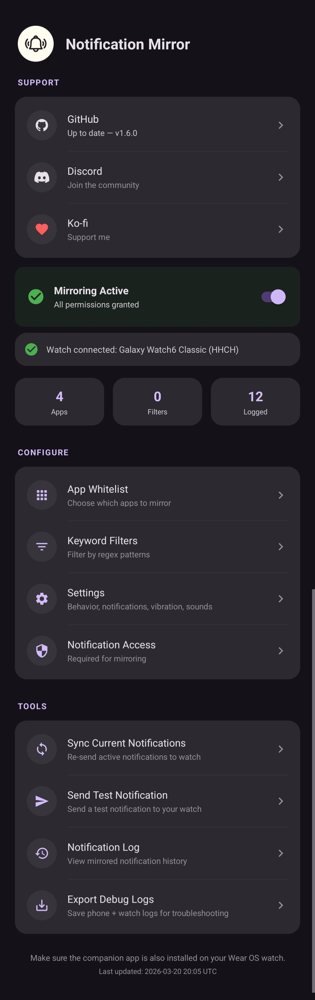
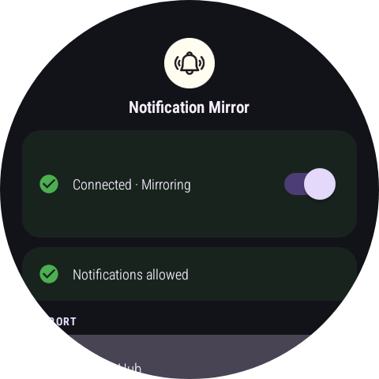
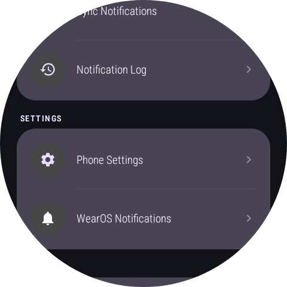
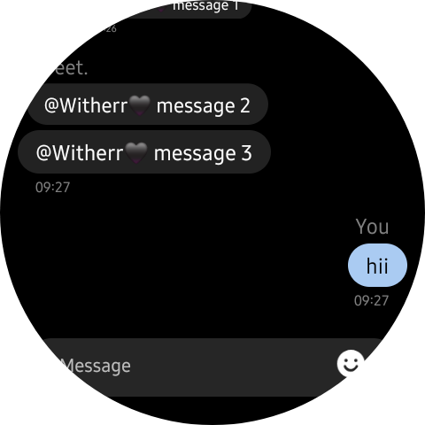
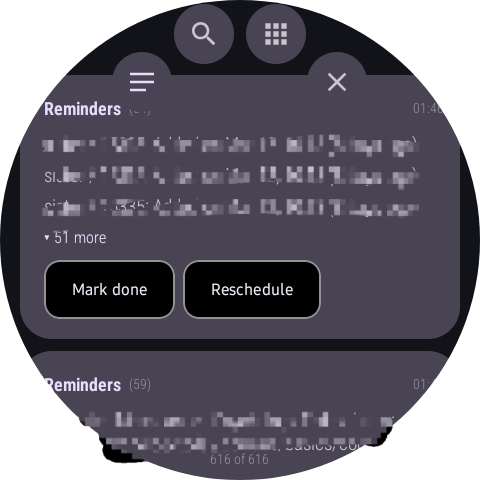
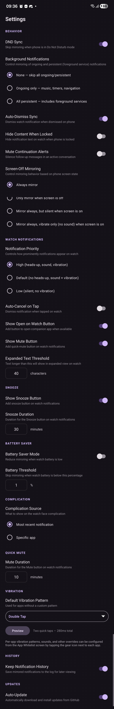
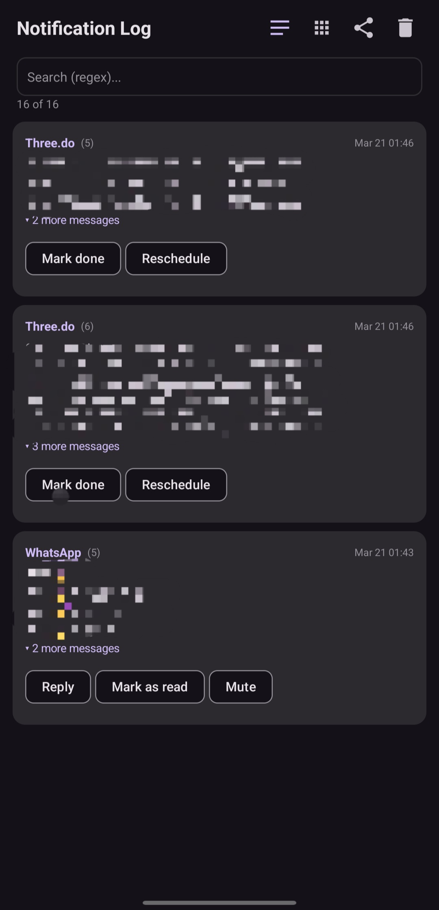

# Notification Mirror

**Fully customizable, lightweight WearOS notification mirroring** — mirror any phone notification to your watch with reply support, action buttons, conversation stacking, and granular per-app control.

Made with help from [Devin AI](https://devin.ai).

---

  
  

  
  
  

---

## Why?

Some apps (like WhatsApp) have their own Wear OS app that handles notifications independently. This means you get different notification behavior on your watch vs phone. This app lets you keep the watch app installed while mirroring your phone's notification experience to the watch, giving you a consistent notification style and the ability to reply directly.

E.g. I personally hate the WhatsApp watch app notifications. It's buggy and not thought through. Sometimes it'll buzz me for "You've been added to this group" notifications on a group I've been in forever. I hate how it beeps and vibrates even tho I have my phone open and possibly even on WhatsApp. I hate that you can't mute specific chats ONLY on the watch. I hate how stiff and uncustomizable they are. BUT I don't wanna uninstall the app either because it's nice to be able to read chat history and send voice messages. 

So that's why this app exists! It basically lets you have the watch app installed AND receive phone app notifications at the same time, with MUCH more granular customization and configuration. E.g. push notifications filtered by words and apps, change phone screen on behaviour, set custom vibration patterns, reply and press notification buttons from the watch, etc.

---

## Features

### Notification Mirroring
- **Real-time mirroring** — phone notifications appear on your watch instantly via encrypted Wearable Data Layer
- **Inline reply** — reply to mirrored notifications directly from the watch (WhatsApp, Telegram, Discord, etc.)
- **All notification buttons** — not just reply, but every action button (mark as read, archive, mute, etc.) works from the watch
- **Action feedback** — watch shows real success/failure result after pressing action buttons (e.g. "Reply sent" or "Notification no longer exists")
- **Auto-dismiss sync** — when a notification is dismissed on the phone, it's automatically dismissed on the watch (configurable)
- **Message stacking** — multiple messages in the same conversation stack up using MessagingStyle instead of replacing each other
- **Smart conversation grouping** — messages are grouped by conversation (sender/chat name), not just by app
- **Reply-aware silencing** — after you reply from the watch, the app suppresses the re-alert when the app updates the notification with your sent message (15-second window)

  
  

### Filtering & Control
- **App whitelist** — pick which apps' notifications get mirrored; if none selected, all apps are mirrored
- **Keyword whitelist (regex)** — only mirror notifications matching certain words/patterns
- **Keyword blacklist (regex)** — block notifications matching certain words/patterns
- **Per-app keyword filters** — set separate whitelist/blacklist regex patterns for individual apps
- **Per-app settings** — override any global setting on a per-app basis (priority, vibration, screen-off mode, ongoing mode, mute duration, snooze, and more)

### Watch Notifications
- **Per-app notification groups** — each app's notifications are grouped separately on the watch, with the app name shown in each notification
- **App icons** — each notification shows the source app's icon (cached with LRU for performance)
- **"Open on Watch" button** — if the source app has a companion watch app (WhatsApp, Spotify, etc.), a button appears to open it (configurable)
- **Quick-mute from watch** — every mirrored notification has a "Mute Xmin" button to temporarily stop mirroring that app (duration configurable per-app)
- **Snooze button** — snooze individual notifications for a configurable duration (per-app)
- **Per-app custom sounds** — set a custom notification sound for any app via the watch notification channel
- **Vibration patterns** — 12 built-in presets (Default, Short Buzz, Long Buzz, Double Tap, Triple Tap, Gentle, Strong, Heartbeat, Pulse, Ramp Up, SOS, Silent) + custom pattern support, configurable globally and per-app
- **Alert mode** — sound, vibrate, or mute per notification, configurable globally and per-app
- **Notification priority** — configurable (High / Default / Low), per-app
- **Auto-cancel on tap** — configurable, per-app
- **BigText threshold** — configurable character count before expanded text kicks in, per-app

### Behavior Settings
- **DND sync** — skip mirroring when phone is in Do Not Disturb mode
- **Screen-off mirroring mode** — four modes: always mirror / only when screen off / mirror but silent when screen on / mirror but vibrate only when screen on
- **Background notifications** — three modes for ongoing/persistent notifications: skip all / ongoing only (music, timers, navigation) / all persistent (includes foreground services)
- **Hide content when locked** — hide notification text on the watch when the phone is locked
- **Mute continuation alerts** — silence follow-up messages in an active conversation (same-channel silent update)
- **Battery saver** — automatically reduce mirroring when watch battery is below a configurable threshold

  

### Notification Log
- **Notification history** — all mirrored notifications are logged with encrypted storage (auto-prunes after 1 week)
- **Search (regex)** — search through logs with regex on both phone and watch
- **App filter dropdown** — filter log by source app
- **Functional action buttons in log** — replay actions (mark as read, reply, etc.) and re-push notifications directly from the log
- **Export** — export logs as CSV + JSON via share sheet (phone)
- **Paginated loading** — logs load 50 entries at a time for smooth scrolling

  

### Watch App
- **Watch face complication** — shows the latest notification content on your watch face (configurable: most recent notification or a specific app)
- **Wear Tile** — quick-glance tile showing notification counts per app, with action buttons for Pause/Resume mirroring, Mute/Unmute all, and connection info
- **Notification settings shortcut** — button to open WearOS granular notification settings
- **Mirroring toggle** — pause/resume mirroring directly from the watch (synced to phone)
- **Support section** — GitHub (with version/update status) and Discord buttons that open links on your phone
- **Bezel/rotary scrolling** — native rotary input support for scrolling through the watch UI
- **Auto permission requests** — watch app asks for required permissions on first launch, with a status card showing permission state

### Phone App
- **Dashboard** — at-a-glance status showing mirroring state, watch connection, app/filter/log counts
- **Mirroring toggle** — pause/resume mirroring with real-time sync to watch
- **Test notification button** — send a custom test notification to the watch on behalf of any app, respecting that app's per-app settings
- **Sync current notifications** — re-send all active phone notifications to the watch
- **Auto-update** — automatically check for and install updates from GitHub releases
- **Battery optimization prompt** — reminds you to allow unrestricted battery for reliable background operation
- **Auto permission requests** — phone app asks for notification access and unrestricted battery on launch
- **GitHub link** — quick link to the project repo with version and update status
- **Discord link** — quick link to the [Discord server](https://discord.gg/gK6wQywwzb)
- **Ko-fi link** — quick link to support the developer on [Ko-fi](https://ko-fi.com/wthrr)

### Security
- **End-to-end encryption** — all notification data between phone and watch is encrypted with AES-256-GCM
- **Encrypted storage** — notification log and offline queue are encrypted at rest
- **Offline queue** — notifications are queued (up to 50) when the watch is disconnected and delivered automatically on reconnect

---

## Setup

### Download
1. Download the phone and watch APKs from the [releases page](https://github.com/WitherredAway/NotificationMirror/releases) (or build the APKs yourself, scroll down for that)

### Install
You'll have to sideload the watch APK using one of these tools:
- [Wear Installer 2](https://play.google.com/store/apps/details?id=org.freepoc.wearinstaller2) ([Website](https://freepoc.org/wear-installer-2-help-page/)) — simple ADB-based installer over Wi-Fi
- [WearLoad](https://play.google.com/store/apps/details?id=com.camope.wearload) ([Website](https://wearload.github.io/index_en.html) · [XDA](https://xdaforums.com/t/app-wear-os-wearload-install-apk-apks-zip-without-debug-mode-and-adb.4766128/)) — install APKs without debug mode or ADB
- [GeminiMan WearOS Manager](https://play.google.com/store/apps/details?id=com.geminiman.wearosmanager) — full-featured watch manager with app installer
- Or use `adb` directly from a computer

If Google Play prevents you from installing the phone APK, please use [Install With Options](https://github.com/zacharee/InstallWithOptions) to install it.

1. Install the `mobile` APK on your Android phone
2. Install the `wear` APK on your Wear OS watch
3. Open the phone app and grant **Notification Access** permission, disable Battery Optimization
4. Open the watch app and grant the Notification permission
5. Make sure phone and watch are paired

### Usage
1. Once notification access is granted, the phone app runs in the background
2. Any notification that appears on your phone will be mirrored to your watch
3. For notifications that support replies (WhatsApp, Telegram, etc.), you can reply directly from the watch
4. Replies are sent back to the phone and executed on the original notification's reply action

---

## How It Works

1. **Phone captures notification** — `NotificationListenerService` intercepts it
2. **Data encrypted** — notification JSON is encrypted with AES-256-GCM before transmission
3. **Phone sends to watch** — via `MessageClient` (Wearable Data Layer API)
4. **Watch decrypts and displays** — as a local notification with the same title, text, app icon, and action buttons
5. **User replies on watch** — reply text sent back to phone via `MessageClient`
6. **Phone executes reply** — uses the original notification's `RemoteInput` action
7. **Offline resilience** — if watch is disconnected, notifications are queued and delivered on reconnect

## Notes

- Both devices must be connected via Bluetooth for real-time mirroring
- The phone and watch apps share the same application ID for Wearable API pairing
- Background notification behavior (ongoing/persistent) is configurable with three granularity levels
- All data in transit and at rest is encrypted with AES-256-GCM
- Notification log auto-prunes entries older than 1 week

## Architecture

This is a multi-module Android project:

- **`mobile/`** — Phone companion app
  - `NotificationListener` — captures phone notifications, encrypts them, and forwards to watch via Wearable Data Layer API
  - `ReplyReceiverService` — receives replies and action triggers from the watch, executes them on the original notification
  - `SettingsManager` — manages all global and per-app settings with regex caching for keyword filters
  - `CryptoHelper` — AES-256-GCM encryption/decryption, key generation and storage
  - `OfflineQueue` — queues notifications when watch is disconnected, encrypted at rest
  - `WearSyncHelper` — syncs mirroring state and app icons to watch with LRU caching

- **`wear/`** — Wear OS watch app
  - `PersistentListenerService` — foreground service that receives mirrored notifications and data sync events
  - `NotificationHandler` — builds and displays watch notifications with conversation stacking, reply-aware silencing, and per-app channels
  - `MessageHelper` — shared message routing with decryption and error handling
  - `NotificationComplicationService` — watch face complication data source
  - `NotificationTileService` — Wear Tile with notification counts and quick actions
  - `ReplyActivity` — handles sending replies back to the phone

## Building

### Prerequisites
- Android Studio (Arctic Fox or later)
- Android SDK 34
- Wear OS emulator or physical watch

### Build
1. Open the project in Android Studio
2. Sync Gradle
3. Build both `mobile` and `wear` modules
